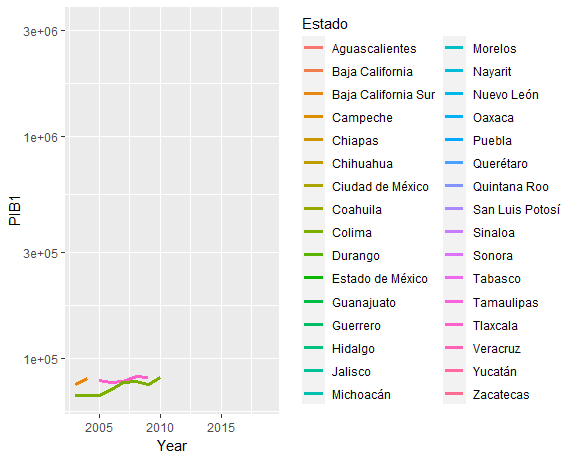
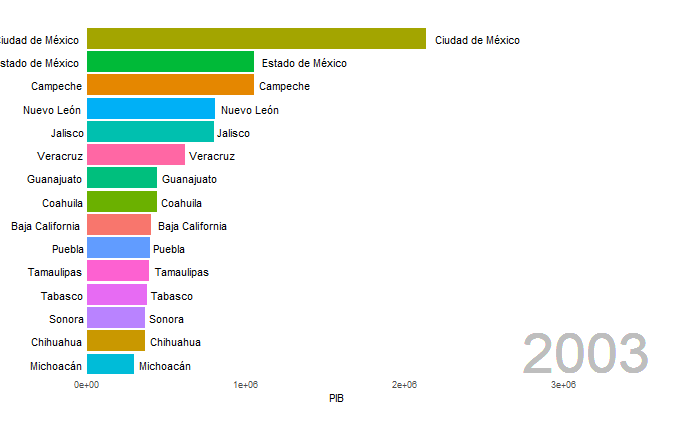

```{r setup, include=FALSE}
library(flexdashboard)
library(knitr)
library(DT)
library(rpivotTable)
library(ggplot2)
library(plotly)
library(dplyr)
library(openintro)
library(highcharter)
library(ggvis)
library(tidyverse)
library(tsibble)
library(feasts)
library(readxl)
#library(tidyr)
library(lubridate)
library(gganimate)
library(gifski)
library(av)
library(gapminder)
library(stringr)
```


```{r}
#PIB <- read_excel("C:/Users/JoseGallardo/Documents/Ajolotec/PAP/BD_INDICADORES_MACROECONOMICOS.xlsx", sheet = "PIB")
PIB <- read_excel("BD_INDICADORES_MACROECONOMICOS.xlsx", sheet = "PIB")
colnames(PIB) <- c("Clave","Estado","Year","Clave_Sector","Nombre_Sector","Actividad","PIB")
 PIB_Test <- PIB %>% as_tsibble(index=Year,key=c(Estado,Nombre_Sector)) %>% 
   group_by(Estado,Nombre_Sector,Actividad) %>% 
  summarise(PIB=sum(PIB))

PIB_Anim <- PIB_Test
PIB_Anim$Nombre_Sector <- NULL
PIB_Anim$Actividad <- NULL

PIB_Anim <- PIB_Anim %>% group_by(Year,Estado) %>% summarise(PIB=sum(PIB)) %>%  
    arrange(Year,desc(PIB)) %>% 
   mutate(ranking = row_number()) %>% filter(ranking<=15)
```


```{r}
mycolors <- c("blue", "#FFC125", "darkgreen", "darkorange")
```

Interactive Data Visualization
=====================================

Row
-------------------------------------

### Producto Interno Bruto

```{r}
valueBox(paste("PIB"),
         color = "warning")
```

### PIB de la Ciudad de México 2019

```{r}
valueBox({t <- PIB_Test %>%  group_by(Estado) %>% 
  summarize(PIB1=sum(PIB)) %>% 
  filter(Estado=="Ciudad de México"& Year=="2019")
  sum(t$PIB1)},
         icon = "fa-user")
```

### PIB del Estado de México 2019

```{r}
valueBox({t <- PIB_Test %>%  group_by(Estado) %>% 
  summarize(PIB1=sum(PIB)) %>% 
  filter(Estado=="Estado de México"& Year=="2019")
  sum(t$PIB1)},
         icon = "fa-user")
```

### PIB de Nuevo León 2019

```{r}
valueBox({t <- PIB_Test %>%  group_by(Estado) %>% 
  summarize(PIB1=sum(PIB)) %>% 
  filter(Estado=="Nuevo León"& Year=="2019")
  sum(t$PIB1)},
         icon = "fa-user")
```

### PIB de Jalisco 2019

```{r}
valueBox({t <- PIB_Test %>%  group_by(Estado) %>% 
  summarize(PIB1=sum(PIB)) %>% 
  filter(Estado=="Jalisco"& Year=="2019")
  sum(t$PIB1)},
         icon = "fa-user")
```

### PIB de Veracruz 2019

```{r}
valueBox({t <- PIB_Test %>%  group_by(Estado) %>% 
  summarize(PIB1=sum(PIB)) %>% 
  filter(Estado=="Veracruz"& Year=="2019")
  sum(t$PIB1)},
         icon = "fa-user")
```

### PIB de Guanajuato 2019

```{r}
valueBox({t <- PIB_Test %>%  group_by(Estado) %>% 
  summarize(PIB1=sum(PIB)) %>% 
  filter(Estado=="Guanajuato"& Year=="2019")
  sum(t$PIB1)},
         icon = "fa-user")
```

Row
-------------------------------

### PIB por estado (más significativos)

```{r}
p1 <- PIB_Test %>% group_by(Estado) %>% 
  summarize(PIB1=sum(PIB)) %>% 
  filter(Estado=="Jalisco"|
           Estado=="Ciudad de México"|
           Estado=="Estado de México"|
           Estado=="Nuevo León"|
           Estado=="Veracruz"|
           Estado=="Guanajuato") %>% 
  ggplot(aes(x=Year,y=PIB1),size=2) +
  geom_line(aes(color=Estado)) +
  scale_y_log10() #+ 
  #transition_reveal(PIB1)
p1
```

### PIB estados más significativos

```{r}
p2 <- PIB_Test %>% filter(Year==2018) %>%
  group_by(Estado) %>%
  summarise(PIB1 = sum(PIB)) %>%
  filter(PIB1>700000) %>%
  plot_ly(labels = ~Estado,
          values = ~PIB1,
          marker = list(colors = mycolors)) %>%
  add_pie(hole = 0.2) %>%
  layout(xaxis = list(zeroline = F,
                      showline = F,
                      showticklabels = F,
                      showgrid = F),
         yaxis = list(zeroline = F,
                      showline = F,
                      showticklabels=F,
                      showgrid=F))
p2
```

### PIB por tipo de actividad

```{r}
p3 <- PIB_Test %>% filter(Year==2018) %>%
  group_by(Actividad) %>%
  summarise(PIB1 = sum(PIB))  %>%
  plot_ly(labels = ~Actividad,
          values = ~PIB1,
          marker = list(colors = mycolors)) %>%
  add_pie(hole = 0.2) %>%
  layout(xaxis = list(zeroline = F,
                      showline = F,
                      showticklabels = F,
                      showgrid = F),
         yaxis = list(zeroline = F,
                      showline = F,
                      showticklabels=F,
                      showgrid=F))
p3
```

PIB
-------------------------------
```{r}
PIB_Table <- PIB_Test  %>% group_by(Estado) %>%  summarize(Promedio_PIB = mean(PIB,na.rm = TRUE)) %>% top_n(5) %>% arrange(desc(Promedio_PIB))
datatable(PIB_Table,
          caption = "Top 5 Estados más significativos",
          rownames = T,
          options = list(pageLength = 5))
```


```{r}
PIB_Table <- PIB_Test  %>% group_by(Estado) %>%  summarize(Promedio_PIB = mean(PIB,na.rm = TRUE)) %>% arrange(desc(Promedio_PIB))%>% top_n(-5) 
datatable(PIB_Table,
          caption = "Top 5 Estados menos significativos",
          rownames = T,
          options = list(pageLength = 5))
```


Gráfica PIB Animada
=====================================
```{r}
# p4 <- PIB_Test %>% group_by(Estado) %>% 
#   summarize(PIB1=sum(PIB)) %>% 
#   ggplot(aes(x=Year,y=PIB1)) +
#   geom_line(aes(color=Estado),size=1.3) +
#   scale_y_log10() 
# 
# p4 <- p4 + transition_reveal(PIB1)
# 
# anim_save("figs/GIF_TEST.gif",p4)
```


Gráfica PIB Animada
=====================================
```{r}
# animacion <- PIB_Anim %>%
#   ggplot() +
#   geom_col(aes(ranking, PIB, fill = Estado)) +
#   geom_text(aes(ranking, PIB, label = PIB), hjust=-0.1) +
#   geom_text(aes(ranking, y=0 , label = PIB), hjust=1.1) +
#   geom_text(aes(x=15, y=max(PIB) , label = as.factor(Year)), vjust = 0.2, alpha = 0.5,  col = "gray", size = 20) +
#   coord_flip(clip = "off", expand = FALSE) + scale_x_reverse() +
#   theme_minimal() + theme(
#     panel.grid = element_blank(),
#     legend.position = "none",
#     axis.ticks.y = element_blank(),
#     axis.title.y = element_blank(),
#     axis.text.y = element_blank(),
#     plot.margin = margin(1, 4, 1, 3, "cm")
#   ) +
#   transition_states(Year, state_length = 0, transition_length = 2) +
#   enter_fade() +
#   exit_fade() +
#   ease_aes('quadratic-in-out')
# 
# anim_save("figs/GIF_TEST2.gif",animate(animacion, width = 700, height = 432, fps = 25, duration = 15, rewind = FALSE))
```



Detalles Interno Bruto por INEGI
========================================

```{r}
datatable(PIB_Test,
          caption = "Tabla de PIB",
          rownames = T,
          filter = "top",
          options = list(pageLength = 25))
```


